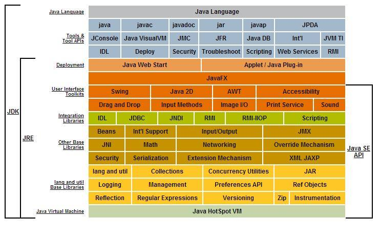

# Java Interview Questions and Notes

## Basics

_What is the diference between Java SE, EE, and ME?_
> **Java SE** is the standard edition platform. includes java core topics like, Classes, Multithreading, Reflections Collections

> **Java EE** is an enterprise platform and is used to devlop web and enterprise applications. Built ontop the Java SE platform, includes topics like Servel, JSP, Web Services, EJB, JPA

> **Java ME** is a micro platform used to develop mobile applications

_What are the features of Java?_
> **Simple**
- syntax is based on C++ so easier to learn fro programers coming from C++
- removed the explicit pointers and operator overloading
- Automatic Garbage Collecting

> **Object-Oriented**
- Object
- Class
- Inheritance
- Polymorphisim
- Abstraction
- Encapsulation

> **Platform Independant**
- Java provides a software-based platform that runs on the top of other hardware-based platforms
- Java code is compiled down to Java Bytecode which runs on a JVM (java virtual machine).
- The bytecode can therefore be platform-independant
- The JVM is basically like a middle man for the bytecode and hardware platform

> **Secured**
- No explicit pointer
- Java programs run inside virtual machine sandbox
- _Classloader_ separated the package of the classes of the local file system
- Bytecode Verfier
- _Secutiry Manager_ determines what resources a class can access such as reading and writing to the local disk

> **Robust**
- Lack of pointers
- Automatic garbage collecting
- exception handling
- type checking

> **Architect-neutral**
- size of primitive types is fixed
- int data-type occupies 4 bytes of memory for both 32 and 64 bit architectures

> **Portable**
- Java bytecode can be carried to any platform

> **High-Performance**
- Java is faster than traditiona interpretation, still slower than compiled language

> **Ditributed**
- Distributed applications RMI and EJB
- Can access files by calling methods from any machine on the internet

> **Multi-threaded**
- a thread is like a separate program, executing concurrently
- Java programs that deal with many tasks at once by defining multiple threads
- Advanage of multi-threading is that it doesn't occupy memory for each thread.
- It shares a common memory area

_Can you save a java source file by other name than the class name?_

>yes if the class is not public
```java
class Thing {
    public static void main (String args[]) {
        System.out.println("Hello");
    }
}
```
>We can save this as **Blah.java**, the compiler will create **Thing.class**

_Can you have multiple classes in a java source file?_
>Yes the compiler will name the classes what need to be in bytecode

_What is the difference between JDK, JRE, and JVM?_
> **JDK**
- Are the tools needed to develop and execute a java program.
- Java Language
- javac compiler
- JRE and JVM

> **JRE**
- Libraries needed to run the Java Apllication
- JavaFX, SWingm AWT, Collections
- JVM

> **JVM**
- Abstract Machine to execute the Java Bytecode
- platfrom dependent

> 


kla;jsdf;lkjasd

asdfasdfasdf

asdfasdf

asdfasdfa

asdfasdf

asdfasdf

asdfasdf

sgfdadfasdf
da
a

asdfasdf
asdf

asdfasdf

asdfasdfa

asdfasdf

adsfasdf

asdfasdf

asdfasdf

asdfasdf


asdfasdfasd

asdfasdf

asdfasdf

asdfasd

asdfasdf

asdfasdf
